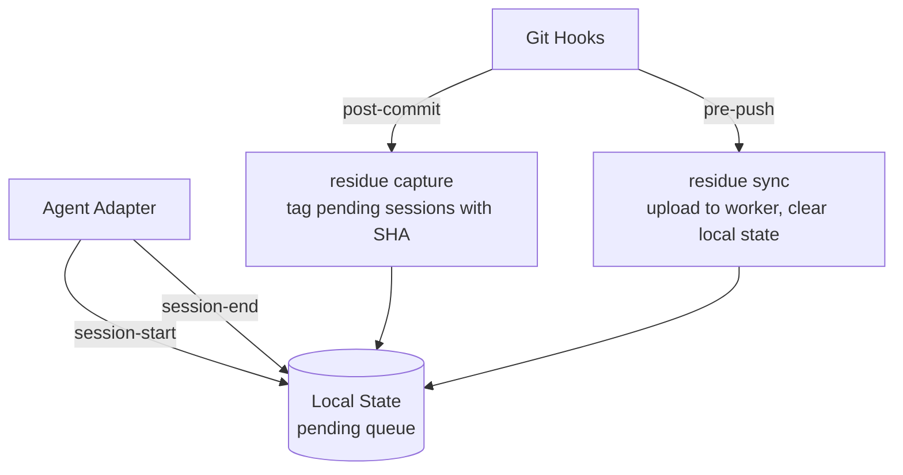

# residue

An open-source CLI + self-hosted backend that captures AI agent conversations and links them to git commits. Every push uploads the conversations that informed your code changes, creating a searchable record of how code was written.

## How It Works

There are two event sources: **agent adapters** and **git hooks**.

Agent adapters call into the CLI when conversations start and end. Git hooks call into the CLI when commits and pushes happen. The CLI maintains local state that connects the two.



1. Adapter calls `residue session start` when a conversation begins
2. User works with the AI agent, making code changes
3. Adapter calls `residue session end` when the conversation ends
4. User commits. The `post-commit` hook tags all pending sessions with the commit SHA
5. User pushes. The `pre-push` hook uploads session data + commit mappings to the worker

A single conversation can span multiple commits. The full session is stored once and multiple commits reference it.

## Architecture

```
packages/
  cli/              -> "@residue/cli" npm package
  worker/           -> Cloudflare Worker (Hono + JSX)
  installer/        -> Deployment installer at install.residue.dev
```

Monorepo managed with pnpm workspaces. Runtime is bun.

## Prerequisites

- [bun](https://bun.sh). Runtime for the CLI.
- A [Cloudflare](https://dash.cloudflare.com) account

## Setup

There are six steps: create the R2 bucket and its S3 API credentials, deploy the worker, set up AI Search, install the CLI, then configure your repos.

---

**One-time setup**

### Step 1: Create an R2 bucket and S3 API token

> **Using the installer?** The installer at [install.residue.dev](https://install.residue.dev) creates the R2 bucket and S3 API credentials automatically. Skip to step 2.

The CLI uploads session data directly to R2 via presigned PUT URLs. You must set these up before deploying the worker.

Create an R2 bucket: [dash.cloudflare.com/?to=/:account/r2/new](https://dash.cloudflare.com/?to=/:account/r2/new)

Create an S3 API token with read/write access to your bucket: [dash.cloudflare.com/?to=/:account/r2/api-tokens](https://dash.cloudflare.com/?to=/:account/r2/api-tokens)

Save these values. You will need them in step 2:

| Value | Source |
|---|---|
| `R2_ACCESS_KEY_ID` | from the API token |
| `R2_SECRET_ACCESS_KEY` | from the API token |
| `R2_ACCOUNT_ID` | your Cloudflare account ID |
| `R2_BUCKET_NAME` | the bucket you just created |

### Step 2: Deploy the worker

The worker stores commit metadata in D1 and serves the web UI. Session data lives in R2 (set up in step 1).

**Option A: Installer (recommended)**

The installer at [install.residue.dev](https://install.residue.dev) automates the entire deployment: creates the D1 database, R2 bucket, S3 API credentials, AI Search instance, sets secrets, and deploys the worker.

You only need a Cloudflare API token with the required permissions. The installer walks you through each step.

**Option B: Deploy to Cloudflare**

[](https://deploy.workers.cloudflare.com/?url=https://github.com/butttons/residue/tree/main/packages/worker)

During deploy, you will be prompted for these secrets:

| Secret | Value |
|---|---|
| `AUTH_TOKEN` | generate a random string. This is your CLI auth token |
| `R2_SECRET_ACCESS_KEY` | from step 1 |
| `ADMIN_PASSWORD` | password for the web UI |

The R2 vars from step 1 (`R2_ACCESS_KEY_ID`, `R2_ACCOUNT_ID`, `R2_BUCKET_NAME`) go into the worker environment variables.

**Option C: Manual**

```bash
# Clone the repo and install dependencies
git clone https://github.com/butttons/residue.git
cd residue
pnpm install
cd packages/worker

# Login to Cloudflare
npx wrangler login

# Create D1 database
npx wrangler d1 create residue-db
# Copy the database_id into wrangler.jsonc

# Update wrangler.jsonc with:
#   d1_databases[0].database_id  -> your D1 ID
#   r2_buckets[0].bucket_name    -> from step 1
#   R2_ACCESS_KEY_ID             -> from step 1
#   R2_ACCOUNT_ID                -> from step 1
#   R2_BUCKET_NAME               -> from step 1
#   ADMIN_USERNAME               -> your choice

# Run migrations
npx wrangler d1 migrations apply residue-app --remote

# Set secrets
echo "your-secret-token" | npx wrangler secret put AUTH_TOKEN
npx wrangler secret put ADMIN_PASSWORD
npx wrangler secret put R2_SECRET_ACCESS_KEY

# Deploy
npx wrangler deploy
```

After any option, note your **worker URL** (e.g. `https://residue.your-subdomain.workers.dev`) and **auth token**.

### Step 3: Set up AI Search

Search requires a Cloudflare AI Search instance connected to your R2 bucket. Without this, the `residue search` and `residue query` commands will not work.

Go to **Compute & AI > AI Search** in the Cloudflare dashboard: [dash.cloudflare.com/?to=/:account/ai/ai-search](https://dash.cloudflare.com/?to=/:account/ai/ai-search)

1. Select **Create**, then **Get Started**
2. Choose your R2 bucket as the data source
3. Leave chunking, embedding, and retrieval settings at their defaults
4. Name the instance **`residue-search`**
5. Complete the setup

After creation, configure path filters so only search-optimized text files are indexed (not raw session data):

Go to the **Settings** tab of your instance: [dash.cloudflare.com/?to=/:account/ai/ai-search/instance/residue-search/settings](https://dash.cloudflare.com/?to=/:account/ai/ai-search/instance/residue-search/settings)

Under **Resources > Path Filters**:

| Filter | Value |
|---|---|
| **Include** | `search/**` |
| **Exclude** | `sessions/**` |

For more details, see the [Cloudflare AI Search docs](https://developers.cloudflare.com/ai-search/get-started/dashboard/).

### Step 4: Install the CLI

Requires [bun](https://bun.sh) as the runtime. Install bun first if you don't have it.

```bash
bun add -g @residue/cli
```

### Step 5: Login

```bash
residue login --url https://residue.your-subdomain.workers.dev --token YOUR_AUTH_TOKEN
```

Saves credentials to `~/.residue/config`. One-time.

Use `--local` to save credentials to `.residue/config` in the current project instead of globally. Useful when different repos connect to different workers.

```bash
residue login --url https://residue.your-subdomain.workers.dev --token YOUR_AUTH_TOKEN --local
```

> **Updating an existing deployment?** Visit [install.residue.dev/update](https://install.residue.dev/update) to update your worker to the latest version.

---

**Per-project setup**

### Step 6: Configure a repository

Run these in any git repo you want to track:

```bash
# Install git hooks (post-commit + pre-push)
residue init

# Set up your agent adapter
residue setup claude-code    # or: residue setup pi, residue setup opencode
```

- `residue init`: installs `post-commit` and `pre-push` hooks, adds `.residue/` to `.gitignore`
- `residue setup claude-code`: adds hooks to `.claude/settings.json`
- `residue setup pi`: installs extension at `.pi/extensions/residue.ts`
- `residue setup opencode`: installs plugin at `.opencode/plugins/residue.ts`

That's it. Commit and push as usual. Conversations are captured and uploaded automatically.

## CLI Commands

**User-facing:**

| Command | Description |
|---|---|
| `residue login` | Save worker URL + auth token to `~/.residue/config`. Use `--local` for per-project config |
| `residue init` | Install git hooks in current repo |
| `residue setup <agent>` | Configure an agent adapter (`claude-code`, `pi`, or `opencode`) |
| `residue push` | Manually upload pending sessions |
| `residue status` | Show current residue state for this project |
| `residue clear` | Remove pending sessions from the local queue. Use `--id` for a specific session |
| `residue search <query>` | Search session history. Use `--ai` for AI-powered search with generated answers |
| `residue read <session-id>` | Read a local session transcript to stdout (for piping to other tools or agents) |
| `residue context` | Output agent-facing documentation to stdout (teaches an AI agent how to use residue) |
| `residue query sessions` | List sessions (filter by `--agent`, `--repo`, `--branch`, `--since`, `--until`) |
| `residue query commits` | List commits (filter by `--repo`, `--branch`, `--author`, `--since`, `--until`) |
| `residue query session <id>` | Get full details for a specific session |
| `residue query commit <sha>` | Get details for a specific commit |

**Hook-invoked (internal):**

| Command | Description |
|---|---|
| `residue capture` | Tag pending sessions with current commit SHA (called by post-commit hook) |
| `residue sync` | Upload sessions to worker (called by pre-push hook) |
| `residue session start` | Register a new session (called by adapters) |
| `residue session end` | Mark a session as ended (called by adapters) |
| `residue hook claude-code` | Handle Claude Code hook events (reads JSON from stdin) |

## Worker

The worker serves both a JSON API and a server-rendered UI.

**API routes** (bearer token auth):

| Route | Description |
|---|---|
| `GET /api/ping` | Health check, returns worker version |
| `POST /api/sessions/upload-url` | Generate presigned R2 PUT URLs for direct upload (raw + search) |
| `POST /api/sessions` | Upload session metadata + commit mappings |
| `GET /api/sessions/:id` | Fetch session metadata + raw data from R2 |
| `GET /api/sessions/:id/metadata` | Fetch session metadata only (no R2 fetch) |
| `GET /api/sessions/:id/commits` | List commits linked to a session |
| `GET /api/repos/:org/:repo` | List commits with linked sessions (paginated via `?cursor=`) |
| `GET /api/repos/:org/:repo/:sha` | Commit detail + sessions + files |
| `GET /api/query/sessions` | List sessions (filter by agent, repo, branch, since, until) |
| `GET /api/query/sessions/:id` | Session detail with commits |
| `GET /api/query/commits` | List commits (filter by repo, branch, author, since, until) |
| `GET /api/query/commits/:sha` | Commit detail with sessions |
| `GET /api/search?q=...` | Search sessions via Cloudflare AI Search |
| `GET /api/search/ai?q=...` | AI-powered search with generated answer |
| `POST /api/users` | Create a user |
| `GET /api/users` | List users |
| `DELETE /api/users/:id` | Delete a user |

**UI routes** (cookie-based session auth, served under `/app`):

| Route | Description |
|---|---|
| `/app/login` | Login page |
| `/app` | List of orgs |
| `/app/:org` | List of repos in org |
| `/app/:org/:repo` | Commit timeline with linked sessions |
| `/app/:org/:repo/:sha` | Commit permalink with full conversation |
| `/app/search` | Search conversations |
| `/app/settings` | Instance settings (visibility, user management) |
| `/app/settings/users` | Manage user accounts |

The instance can be set to **public mode** (anyone can view conversations) or **private mode** (login required). Settings and user management always require authentication. The `ADMIN_USERNAME` user is the super admin who can create and delete other users.

Org and repo are inferred from the git remote URL. No manual configuration needed.

## Development

```bash
# Install dependencies
pnpm install

# Start the worker dev server
pnpm run dev:worker

# Build the CLI
pnpm run build:cli

# Run tests
pnpm --filter @residue/cli test      # CLI tests
pnpm --filter @residue/worker test       # worker tests
```

## Design Decisions

- **No data normalization.** Raw agent session data is stored as-is in R2. The UI uses mappers to transform each agent's format into a common message format for rendering.
- **Direct R2 upload.** Session data is uploaded directly to R2 via presigned PUT URLs, bypassing the worker's request body size limits. The worker only handles lightweight metadata.
- **Search via lightweight text files.** Raw session files are too large and noisy for embedding models. At sync time, the CLI generates a second `.txt` file per session under `search/` in R2 containing only human messages, assistant text, and tool summaries. Cloudflare AI Search indexes only this prefix.
- **Self-hosted.** Each user/team deploys their own Cloudflare Worker. No multi-tenant backend, no data privacy concerns.
- **User management.** The super admin (`ADMIN_USERNAME`) can create additional users via the settings UI or API. Instances can be set to public or private mode.
- **Never block git.** Hooks exit 0 even on errors. Session capture and sync are best-effort.

## Troubleshooting

### `R2 upload failed` / `SignatureDoesNotMatch`

The presigned URL signing is failing because the R2 S3 API credentials on the worker are stale. This happens when the R2 API token is regenerated in the Cloudflare dashboard but the worker secret is not updated.

Fix: update the `R2_SECRET_ACCESS_KEY` secret on the worker.

```bash
echo "<new-secret>" | npx wrangler secret put R2_SECRET_ACCESS_KEY --name residue
```

If the access key ID also changed, update `R2_ACCESS_KEY_ID` in `wrangler.jsonc` vars and redeploy.

## License

MIT
